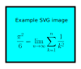

# Introduction

This book provides a practical introduction to the measurement of bioelectrical signals from the human body and to their analysis.
Part 1 explores the origin of bioelectrical signals in the body, initially at the cellular level and then at the macroscopic scale of signals recorded using electrodes on the surface of the skin.
In particular, we will focus on the origin of _biopotentials_, time-varying voltage signals recorded between points on (or in) an organism.
However, the primary aim of this book is to explain the _measurement and analysis_ of these signals, and to equip the reader to design and implement systems that do just that.
Some knowledge of the phyiological origin of biopotentials is certainly useful for the designer of such systems, but a detailed description of the complex processes that give rise to biopotentials is beyond the scope of this book. For that, the reader is instead referred to Malmivuo and Plonsey's excellent book, _Bioelectromagnetism_ @malmivuo_plonsey, which the authors have generously made available for free online.

The following are examples of biopotential signals.

- The electrocardiogram (ECG), which records the electrical activity of the heart,
- The electromyogram (EMG), which records the electrical activity of skeletal muscles, and
- The electroencephalogram (EEG), which records the electrical activity of the brain.

The origin of those signals, and of most other biopotentials, lies in the generation of _action potentials_ in excitable cells - neurons and muscle cells. Our journey therefore begins with a simplified description of the structure and function of neurons, providing a basic understanding of how action potentials are generated. We then zoom out to see how large populations of excitable cells work together to produce the macroscopic signals we observe using surface electrodes attached to the skin, such as the _electrocardiogram_ and the _electroencephalogram_.

# Biopotential signals

## Neurons

A neuron is a nerve cell. Neurons process and transmit information around the body electrochemically. Different types of neuron vary dramatically in size, from less than a millimetre in length to potentially over one metre (for nerves connecting the spinal cord to the toes). It has been estimated that there are between 95-100 billion neurons in the human brain, each of which may be connected to as many as 10,000 other neurons.

Different types of neurons have very different functions. For example, _afferent neurons_ (sensory nerves) relay information from various parts of the body to the central nervous system (CNS, the brain and spinal chord), whereas _efferent neurons_ (motor nerves) relay information from the CNS to the rest of the body to initiate muscle contractions or to control the operation of glands. Unlike many other types of cells in the body, most neurons cannot be replaced if they are destroyed.

### Neuron structure

The structure of a typical neuron is illustrated in Figure 1.

- The soma is the main central section of the neuron from which other parts
branch out. It contains the cell nucleus.
- The dendrites branch out in tree-like structures from the soma. They are the primary source of incoming information to the neuron, receiving signals from potentially thousands of other neurons through their post-synaptic membranes.
- Neurotransmitters released by the presynaptic terminals of other neurons affect the potential of a dendrite’s postsynaptic membrane. If the cumulative effect of the input received from all connected neurons is sufficient to raise the neuron’s membrane potential above a threshold point, an action potential will be generated.
- The axon hillcock is the point at which the axon branches out from the soma.  It has a high density of voltage dependent sodium channels, making it the point with the lowest threshold for action potential initiation.
- The axon is a long (potentially over 1 metre) thin tail emanating out from the soma, which may itself have several branches. Once generated, an action potential propagates along the length of the axon at speeds ranging from 0.5 m/s to 120 m/s depending on the type of neuron.
- The axon is coated by a myelin sheath. Along the length of the axon, there are gaps in the myelin sheath called Nodes of Ranvier. These nodes are about 1 µm apart. An action potential that is propagating down the axon jumps from node to node. The flow of ions through the cell membrane that is required to generate the action potential cannot occur where the myelin sheath is present, so the nodes need to be close enough together for an action potential at one to trigger an action potential in its nearest neighbour – otherwise, the action potential would not propagate down the nerve.
- At the end of the axon is a network of branches, terminating in presynaptic terminals. When these terminals are excited by an action potential arriving through the axon, they release neurotransmitters into the synapse (the junction between neurons).
- These neurotransmitters affect the postsynaptic membranes of many other neurons’ dendrites (in some cases the effect is excitatory; in others it is inhibitory).
- In this way, initiation of an action potential in each neuron is the result of the action potentials of thousands of other neurons. Furthermore, each neuron in turn affects thousands of other neurons each time it generates an action potential. Collectively, large numbers of appropriately arranged neurons can perform complex tasks, such as pattern recognition.

## The electrocardiogram (ECG)

_Electrocardiography_ is the process of recording the electrical activity of the heart to produce an _electrocardiogram_ (ECG, but also sometimes abbreviated as EKG)

## The electromyogram (EMG)

_Electromyography_ is the process of recording an _electromyogram_ (EMG) - a record of the electrical activity of skeletal muscles.

## The electroencephalogram

## The electrooculogram

# Biopotential measurement systems

## Basic electronic circuit concepts

### Elements and networks

- Elements, voltage, current, networks, nodes and node voltages, binary nodes, true nodes, branches and branch currents.
- voltage source, current source, resistor, inductor, capacitor, diode, opamp.
- Ohm's law for resistances.

### Voltage dividers

- Also known as potential dividers.
- Key to understanding the circuits we're building up to.
- Basic passive voltage divider with Vin, Vout and GND.
- The voltage divider as a calculating element - weighted average of two arbitrary noode voltages.

### Impedance and phasors

- Representing sinusoidal voltages and currents as phasors.
- Impedance - describe frequency-dependent relationship between voltage and current in a linear element using a single complex number.

### The operational amplifier

- The ideal opamp - rules of operation.
- The non-inverting opamp circuit.
- 

# Bibliography

# Test text

Horowitz and Hill share much wisdom in their book, *The Art of Electronics* @horowitz1989art. 

Topics covered in that book which are relevant to the present document include:

- resistance
- operational amplifiers
- instrumentation amplifiers

# Test maths

The equations below were inserted using the single dollar marks.

(@foo) An equation $e = mc^2$

(@bar) $e = mc^2$

The equation $e = mc^2$ was inserted as inline maths using single dollar signs.

These equations are enclosed in a TeX environment:

\begin{align}
x=y \\
x=y
\end{align}

So is this one:

\begin{equation}
x=y
\end{equation}

This one uses markdown's double dollars marks:

(@blah) $$y = mx + c$$

Now, let's try referring to equation \ref{myeqn}.

\begin{equation}\label{myeqn}
x=y
\end{equation}

As you can see, the LaTeX and markdown equation numbers appear to be counted independently of each other :(

# Test image

Here's an example image:

Here's an SVG image:

