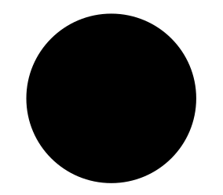

# Test text

Horowitz and Hill share much wisdom in their book, *The Art of Electronics* @horowitz1989art. 

Topics covered in that book which are relevant to the present document include:

- resistance
- operational amplifiers
- instrumentation amplifiers

# Test maths

The equations below were inserted using the single dollar marks.

(@foo) An equation $e = mc^2$

(@bar) $e = mc^2$

The equation $e = mc^2$ was inserted as inline maths using single dollar signs.

These equations are enclosed in a TeX environment:

\begin{align}
x=y \\
x=y
\end{align}

So is this one:

\begin{equation}
x=y
\end{equation}

This one uses markdown's double dollars marks:

(@blah) $$y = mx + c$$

Now, let's try referring to equation \ref{myeqn}.

\begin{equation}\label{myeqn}
x=y
\end{equation}

As you can see, the LaTeX and markdown equation numbers appear to be counted independently of each other :(

# Test image

Here's an example image:

# Bibliography

